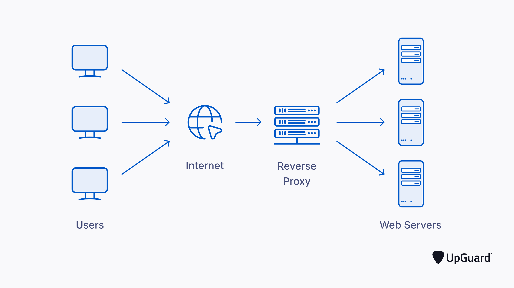

# simple reverse proxy
A simple implementation of reverse proxy in golang

## What is a reverse-proxy
A reverse proxy is a server sits in front of backend servers and forwards client request to those backend servers.
Insure the no client ever communicates directly with the backend server.
## Why we need a reverse-proxy
- To increase security
- Performance
- Reliability
## Benefits of a reverse-proxy
- Load balancing
- Protect from attacks: The backend servers never reveal the IP address so it's harder to target
- Caching
- SSL encryption: Can be configured to decrypt all incoming requests and encrypt all outgoing responses --> backend servers don't need to handle expensive encrypt/decrypt
## Drawbacks of a reverse-proxy
- Increase complexity
- Increase latency
- Setups are difficult
- Not really immune to hackers
## References
- https://www.cloudflare.com/learning/cdn/glossary/reverse-proxy/
- https://www.upguard.com/blog/what-is-a-reverse-proxy
- https://www.okta.com/au/identity-101/reverse-proxy/#:~:text=Drawbacks%20of%20reverse%20proxy%20systems&text=It%20can%20be%20frustrating%20to,take%20over%20a%20company's%20servers.https://www.okta.com/au/identity-101/reverse-proxy/#:~:text=Drawbacks%20of%20reverse%20proxy%20systems&text=It%20can%20be%20frustrating%20to,take%20over%20a%20company's%20servers. 
